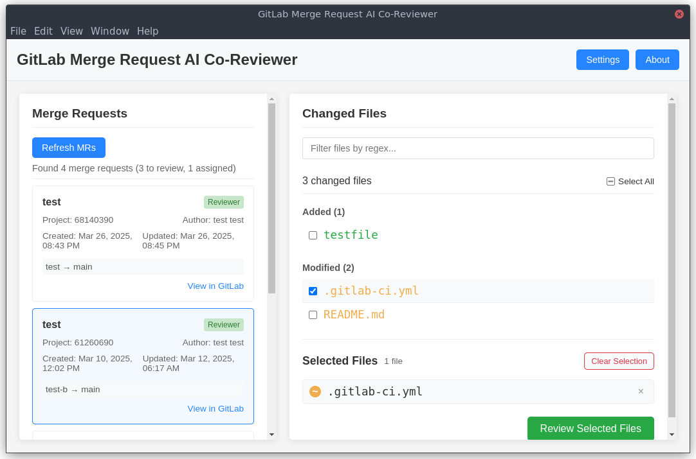

# GitLab Merge Request AI Co-Reviewer

A cross-platform Electron application for viewing and managing GitLab merge requests with integrated AI code review capabilities powered by GitHub Copilot.

## Features

- View all merge requests assigned to you
- Browse changed files for each merge request
- AI-powered code review suggestions
- Get automated code analysis and improvements
- Select files to review
- Cross-platform (Windows, macOS, Linux)

### Screenshots




## Prerequisites

- Node.js 18+
- npm or yarn
- A GitLab personal access token with `api` scope
- GitHub Copilot access for AI features

## Installation

1. Clone this repository
2. Install dependencies:

```bash
npm install
```

3. Build the TypeScript code:

```bash
npm run build
```

4. Start the application:

```bash
npm start
```

## Development

For development with hot reloading:

```bash
npm run dev
```

## Usage

1. When you first start the app, you'll need to configure your GitLab settings.
2. Enter your GitLab URL (e.g., https://gitlab.com) and your personal access token.
3. After saving, the app will load your assigned merge requests.
4. Click on a merge request to view its changed files.
5. Select files you want to review by checking the checkboxes.
6. Use the AI review feature to get automated code suggestions and improvements.

## Creating a GitLab Personal Access Token

1. Log in to your GitLab account
2. Go to your Profile Settings > Access Tokens
3. Create a new personal access token with `api` scope
4. Copy the token and use it in the app settings

## License

Apache-2.0

## Repository

https://github.com/EvoGroupTN/gitlab-ai-co-reviewer
